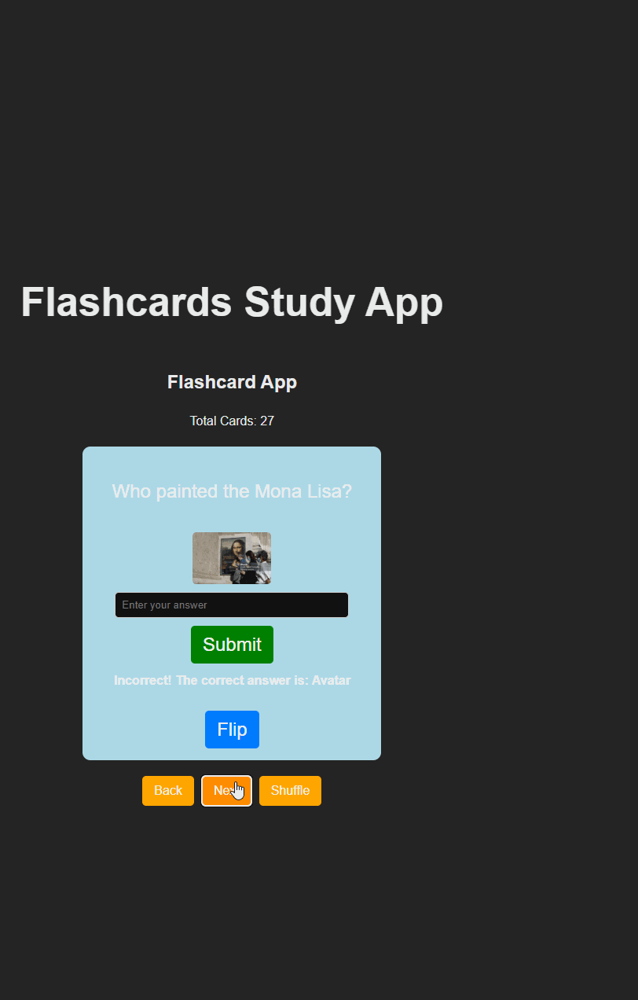

# Web Development Project 3 - Flashcards Study App

Submitted by: Kevon Dawkins

This web app: **allows users to study flashcards by entering answers, flipping cards, and navigating between different questions. Users can also shuffle the cards for a randomized study session.**

Time spent: 12 hours spent in total

## Required Features

The following **required** functionality is completed:

- [x] **The user can enter their guess in a box before seeing the flipside of the card**
- [x] **Clicking on a submit button shows visual feedback about whether the answer was correct or incorrect**
- [x] **A back button is displayed on the card and can be used to return to the previous card in a set sequence**
- [x] **A next button is displayed on the card and can be used to navigate to the next card in a set sequence**

The following **optional** features are implemented:

- [x] A shuffle button is used to randomize the order of the cards
- [x] A user's answer may be counted as correct even when it is slightly different from the target answer
-  A counter displays the user's current and longest streak of correct responses
-  A user can mark a card that they have mastered and have it removed from the pool of answers as well as added to a list of mastered cards

The following **additional** features are implemented:

* [x] Flashcards include images for better engagement.
* [x] The app is mobile-friendly and fully responsive.
* [x] Cards are styled differently based on categories.

## Video Walkthrough

Here's a walkthrough of implemented user stories:

<!-- If GIF is hosted online, replace the local path with your GIF URL -->
<!-- Example:  -->

GIF created with **ScreenToGif (Windows) / Kap (Mac) / Peek (Linux)**.

## Notes

Describe any challenges encountered while building the app.
-creating buttons as sometimes I forgot the procedures
-getting images 
-creating questions

## License

    Copyright 2025 Kevon Dawkins

    Licensed under the Apache License, Version 2.0 (the "License");
    you may not use this file except in compliance with the License.
    You may obtain a copy of the License at

        http://www.apache.org/licenses/LICENSE-2.0

    Unless required by applicable law or agreed to in writing, software
    distributed under the License is distributed on an "AS IS" BASIS,
    WITHOUT WARRANTIES OR CONDITIONS OF ANY KIND, either express or implied.
    See the License for the specific language governing permissions and
    limitations under the License.
